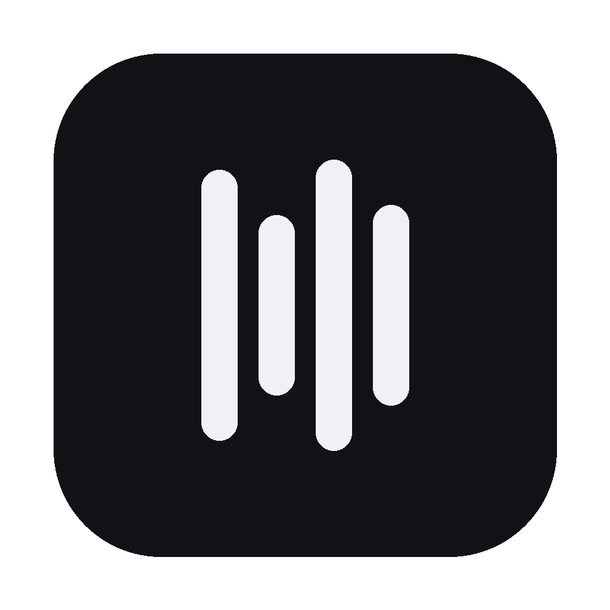
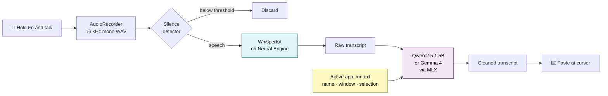
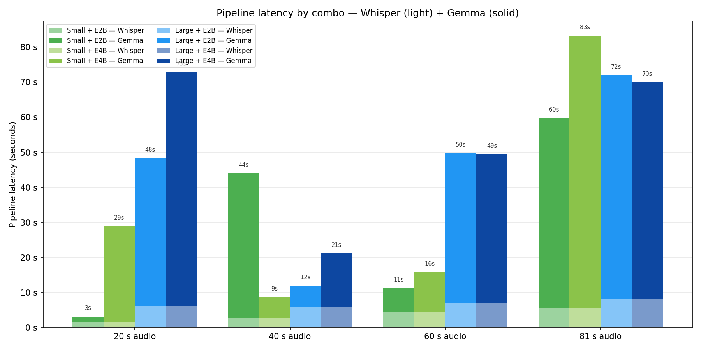
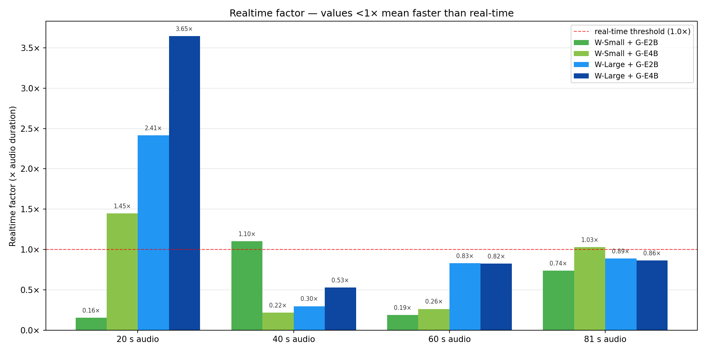

<p align="center">
  
</p>

<h1 align="center">geMMaFloW</h1>

<p align="center">
  100% local, 100% private voice-to-text for macOS — <b>WhisperKit + Qwen 2.5 (or Gemma 4)</b>, zero cloud.
</p>

<p align="center">
  <sub>Apple Silicon · macOS 14+ · MIT licensed</sub>
</p>

<p align="center">
  <a href="https://github.com/verdana86/geMMaFloW/releases/latest">
    
  </a>
</p>

---

<p align="center">
  
</p>

<p align="center">
  <i>Demo preserved from upstream <a href="https://github.com/zachlatta/freeflow">FreeFlow</a> — the UX is identical, only the backend changed (local WhisperKit + Qwen/Gemma instead of cloud Groq).</i>
</p>

---

## Download & install

Grab the latest DMG from the [**Releases page**](https://github.com/verdana86/geMMaFloW/releases/latest) → `geMMaFloW.dmg`.

1. Open the DMG, drag **geMMaFloW** into **Applications**.
2. First launch: macOS will say the developer can't be verified — the DMG is signed with a local developer identity, not Apple-notarised yet. **Right-click the app icon → Open** (or open **System Settings → Privacy & Security → Open Anyway**).
3. Run the in-app setup wizard once. It downloads Whisper + the cleanup LLM (~2.5 GB for the default Whisper Large + Qwen 2.5 pair) and compiles Whisper for your Neural Engine (3–7 min the first time). The wizard shows a sentence you can read aloud while the models warm up.

Requires macOS 14+ on Apple Silicon (M1/M2/M3/M4/M5). ~7 GB free disk, 16 GB RAM recommended.

Prefer building from source? See [Build from source](#build-from-source) below.

---

## What is geMMaFloW?

geMMaFloW is a macOS menu-bar dictation app. You hold a hotkey (`Fn` by default), talk, release, and a cleaned-up transcript gets pasted into whatever text field you were focused on — email, Slack, code editor, browser, anything. Think Wispr Flow, Superwhisper, or Monologue — but **nothing ever leaves your Mac**. No cloud, no API keys, no account, no telemetry. Speech recognition and text cleanup both run locally on Apple Silicon.

It's built for people for whom privacy isn't a nice-to-have: lawyers, doctors, journalists, consultants, or just anyone uncomfortable with the idea of a global hotkey that streams every dictation to someone else's server.

## Why a fork?

geMMaFloW is a personal fork of [FreeFlow](https://github.com/zachlatta/freeflow) by [Zach Latta](https://github.com/zachlatta), a lovely open-source alternative to the commercial dictation apps mentioned above. FreeFlow has the UX right — menu bar, hold-to-talk, context-aware cleanup — but it sends two things to [Groq](https://groq.com/)'s cloud every time you dictate:

1. **Your raw audio**, to `whisper-large-v3` for transcription
2. **The transcript + context about the app you're dictating into**, to `gpt-oss-20b` (or Llama 4) for cleanup

Groq is fast and cheap (~$1/month under heavy use), and Zach's choice is perfectly reasonable. But the audio leaves your computer, and the cleanup LLM sees whatever you just said plus hints about the window you were focused on. For a tool that sits on the global hotkey and sees *everything you dictate all day long*, that tradeoff didn't sit right with me. I wanted the same UX with a stricter guarantee.

So I replaced both cloud calls with on-device models:

| Stage | FreeFlow upstream | **geMMaFloW** |
|---|---|---|
| Speech → text | Groq `whisper-large-v3` (cloud) | [**WhisperKit**](https://github.com/argmaxinc/WhisperKit) on the Neural Engine |
| Text cleanup + context | Groq `gpt-oss-20b` / Llama 4 (cloud) | [**Qwen 2.5 1.5B**](https://huggingface.co/mlx-community/Qwen2.5-1.5B-Instruct-4bit) (default) or [**Gemma 4**](https://ai.google.dev/gemma), via [**MLX Swift**](https://github.com/ml-explore/mlx-swift) |
| Active-app context inference | Groq `/chat/completions` | Local Accessibility API, no LLM call |
| API keys required | Groq key | **none** |

Audio never leaves your Mac. LLM inference never leaves your Mac. After the first-run model download, the app doesn't need an internet connection at all.

---

## How it works

Dictation is a three-stage local pipeline. Everything in the diagram below runs in-process on your Mac — there is no server component and no network round-trip on the hot path.



### Stage 1 — Capture

The hotkey manager ([HotkeyManager.swift](Sources/HotkeyManager.swift)) listens globally for the configured shortcut (default `Fn`, rebindable). While it's held down, [AudioRecorder.swift](Sources/AudioRecorder.swift) captures microphone audio via `AVAudioEngine`, with live level normalization so the input never clips or whispers.

On release, the recording is normalized to 16 kHz mono Int16 WAV ([AudioNormalization.swift](Sources/AudioNormalization.swift)) — the format WhisperKit expects — and passed through a silence detector ([AudioSilenceDetector.swift](Sources/AudioSilenceDetector.swift)) that drops near-empty clips to avoid the classic Whisper hallucinations ("Thank you.", "[Music]", etc.).

### Stage 2 — Transcribe (local)

[TranscriptionService.swift](Sources/TranscriptionService.swift) hands the WAV to [WhisperKitBackend.swift](Sources/WhisperKitBackend.swift). WhisperKit runs Apple's Core ML port of Whisper directly on the Neural Engine. The first call loads the model (~1–3 s depending on variant); subsequent calls reuse a warm instance cached in memory, so a dictation is typically 1–2 s of transcription for a 10 s clip on an M-series chip.

Two model variants are curated in [WhisperKitModelChoice.swift](Sources/WhisperKitModelChoice.swift):

| Variant | Size | Use when |
|---|---|---|
| Large v3 (default) | ~1.5 GB | Best accuracy, especially for non-English and technical vocabulary |
| Small | ~220 MB | Tight on disk or RAM |

### Stage 3 — Clean up (local)

The raw Whisper output has filler words, no punctuation, and sometimes misspellings of domain terms. [PostProcessingService.swift](Sources/PostProcessingService.swift) feeds it to [LocalLLMBackend.swift](Sources/LocalLLMBackend.swift), which runs a 4-bit quantized LLM via [MLX Swift](https://github.com/ml-explore/mlx-swift). The system prompt (in `PostProcessingService.swift`) instructs the model to:

- Preserve the user's intent and words — don't paraphrase
- Apply self-corrections the user spoke ("no, sorry, I meant *Thursday*")
- Add punctuation and capitalization
- Format times (`18:46`) and bullet lists (`A… B… C…`) when the speaker's intent is clear
- Respect a user-defined custom vocabulary (technical terms, names, acronyms)
- Adapt formatting to the app you're dictating into (email vs. code vs. chat)

Three cleanup LLMs ship, all 4-bit quantized:

| Variant | Size | Use when |
|---|---|---|
| Qwen 2.5 1.5B (default) | ~870 MB | Best speed/size trade-off. Clean, natural cleanup in well under a second. |
| Gemma 4 E2B | ~3.5 GB | You prefer Gemma's punctuation style and have the headroom |
| Gemma 4 E4B | ~5 GB | Maximum cleanup quality on long mixed-language dictation |

See [Performance](#performance) below for a reproducible benchmark of all Whisper × LLM combinations.

### App-context awareness (still local)

[AppContextService.swift](Sources/AppContextService.swift) collects a small context packet about the frontmost app — its name, the window title, any text you had selected — through the macOS Accessibility API. In upstream FreeFlow this context was sent to the cloud LLM for summarization. Here it's just concatenated into the cleanup LLM prompt locally. No screenshot, no OCR, no network call.

### Paste

Finally [AppState.swift](Sources/AppState.swift) preserves the current clipboard, pastes the cleaned transcript at the cursor via `NSPasteboard` + `AXUIElement`, and restores what you had in the clipboard before. You end up with text in the field you were focused on and an unchanged clipboard.

---

## Privacy model

This is the part I care about most, so here's the explicit claim with the evidence:

> **No audio, no transcript, and no contextual metadata ever leaves your Mac as part of normal dictation.**

How that's enforced in the code:

- The cloud transcription backend and the cloud LLM backend classes have been **removed**, not just disabled. The only `TranscriptionBackend` that gets instantiated is `WhisperKitBackend`; the only `LLMBackend` is `LocalLLMBackend`.
- `AppContextService` no longer calls any LLM — the constructor explicitly comments "Local-only: LLM-based context inference is disabled" and the HTTP path is dead code awaiting removal.
- The app ships with **no network entitlements**. Check [GemmaFlow.entitlements](GemmaFlow.entitlements): it grants microphone + unsigned executable memory (required by MLX / WhisperKit JIT), and nothing for network or local-network access. The App Sandbox therefore refuses outbound connections.
- No API keys, accounts, or sign-in anywhere in the app.

The **one** thing that does touch the network, one time: WhisperKit and MLX fetch their models from Hugging Face on first launch. After that first download you can airplane-mode the Mac forever and dictation keeps working. Model caches live under `~/.cache/huggingface/hub/` and can be wiped from Settings.

More detail in [docs/PRIVACY.md](docs/PRIVACY.md).

---

## Performance

geMMaFloW ships two Whisper variants (Small, Large-v3) and three cleanup LLMs (Qwen 2.5 1.5B, Gemma 4 E2B, Gemma 4 E4B) — six combinations to trade off speed and quality. The matrix below comes from a reproducible benchmark (`scripts/run-bench.sh`) on a single Apple Silicon laptop with TTS-generated audio (macOS `say`, voice Samantha). Same audio clip trimmed to 20 s / 40 s / 60 s / 81 s so you can see how each pipeline scales with length.

### Total latency per pipeline (Whisper transcribe + LLM cleanup)

<p align="center">
  
</p>

Light bars = Whisper transcription, solid bars = cleanup LLM (Qwen or Gemma). Whisper is predictable and sub-linear in audio length; the cleanup LLM dominates the wall-clock budget and scales with transcript length.

### Realtime factor (latency ÷ audio duration — lower is better)

<p align="center">
  
</p>

Below the red line = faster than real-time. On 81 s clips, **Whisper Large + Qwen 1.5B hits 0.28×** — the cleaned transcript lands in under 23 s for 81 s of audio, roughly 3.6× faster than the clip itself.

### Pick by use case

| Use case | Combo | Trade-off |
|---|---|---|
| **Default** | Whisper Large + Qwen 1.5B | Accurate transcription + fast, natural cleanup. 0.28× realtime on 81 s (~23 s). |
| **Lightest** | Whisper Small + Qwen 1.5B | Smallest RAM + disk footprint (~2 GB total). Small mis-hears rare terms (`metallib` → `Metallab`, `latency` → `agency`). |
| **Higher-quality cleanup** | Whisper Large + Gemma E2B / E4B | Sometimes produces more natural punctuation than Qwen on tricky dictation, at 2-4× the latency. Pick if you dictate long mixed-language text. |
| **Avoid** | Whisper Small + Gemma E4B | E4B can't rescue what Small mis-heard; you pay Gemma's full cost without the quality win. |

All sample transcripts per combo are in [docs/benchmark/results.md](docs/benchmark/results.md). Reproduce with `scripts/run-bench.sh` (downloads all six models first, then runs the matrix — takes ~35 min cold, ~10 min warm).

**Caveats**: LLM timings are noisy across runs. The primed KV cache (from the warmup phase) boosts the first post-warmup call, and MLX memory pressure with three LLMs resident simultaneously can force swaps — in particular the bench loads Qwen + E2B + E4B together, which makes every call worst-case. In real use you only have one LLM loaded at a time, so expect Qwen's latency in-app to be even lower than the chart suggests. For production-grade numbers you want N≥3 runs per cell with the non-target LLM variants evicted.

---

## Requirements

- **macOS 14 (Sonoma) or newer**
- **Apple Silicon** (M1 / M2 / M3 / M4 / M5). Intel Macs are not supported and won't be — MLX + WhisperKit both target the ANE / Metal on Apple Silicon.
- **~2.5 GB** of disk for the default model pair (Whisper Large v3 + Qwen 2.5 1.5B). Up to ~7 GB if you opt into Gemma E4B for cleanup.
- **16 GB** of RAM recommended. 8 GB works with the Small + E2B pair but is tight with both defaults loaded.

---

## Build from source

```bash
git clone https://github.com/verdana86/geMMaFloW.git
cd geMMaFloW
make          # builds, codesigns, and produces GemmaFlow.app
make run      # or just open build/GemmaFlow.app
```

The `Makefile` handles a quirk of MLX + SwiftPM: SPM doesn't compile `.metal` shaders, so the build shells out to `xcodebuild` to produce `default.metallib` and copies it into the app bundle. It also codesigns with a stable self-signed identity (`geMMaFloW Dev Signer`) so that Accessibility / Microphone TCC prompts persist across rebuilds.

First launch opens a setup wizard that walks you through permissions (Microphone, Accessibility, Screen Recording), hotkey binding, and the initial Whisper + cleanup-LLM model downloads. After that the app lives in the menu bar.

---

## Documentation

- [docs/ARCHITECTURE.md](docs/ARCHITECTURE.md) — module-by-module breakdown of the codebase
- [docs/PRIVACY.md](docs/PRIVACY.md) — detailed privacy model with the code citations
- [docs/analysis/PLAN.md](docs/analysis/PLAN.md) — working plan / roadmap (mostly in Italian)
- [docs/clean-install-test.md](docs/clean-install-test.md) — clean-machine install checklist

---

## Status

Active personal fork. The pipeline works end-to-end: hotkey → WhisperKit → Qwen 2.5 (or Gemma 4) → paste, fully offline. What's still rough:

- The setup wizard still has some leftover phrasing from the cloud-era onboarding; a rewrite is queued
- The rebrand from "FreeFlow" → "GemmaFlow" is not fully propagated in UI strings yet
- No notarized release build — build from source for now

See [docs/analysis/PLAN.md](docs/analysis/PLAN.md) for what's next.

---

## Credits

- [**FreeFlow**](https://github.com/zachlatta/freeflow) by Zach Latta — the UX, the dictation scaffolding, the clever context-aware prompting. This fork is a remix, not a rewrite.
- [**WhisperKit**](https://github.com/argmaxinc/WhisperKit) by Argmax — on-device speech recognition on the Neural Engine.
- [**MLX Swift**](https://github.com/ml-explore/mlx-swift) by Apple and [**mlx-swift-examples**](https://github.com/ml-explore/mlx-swift-examples) — native LLM inference on Apple Silicon.
- [**Qwen 2.5**](https://qwen.readthedocs.io/) by Alibaba Cloud (quantized for MLX by [mlx-community](https://huggingface.co/mlx-community)) — the default cleanup model.
- [**Gemma**](https://ai.google.dev/gemma) by Google DeepMind — alternative cleanup model.

---

## License

MIT — same as the FreeFlow upstream. See [LICENSE](LICENSE) (Copyright © 2026 Zach Latta, preserved as required by the upstream license).
