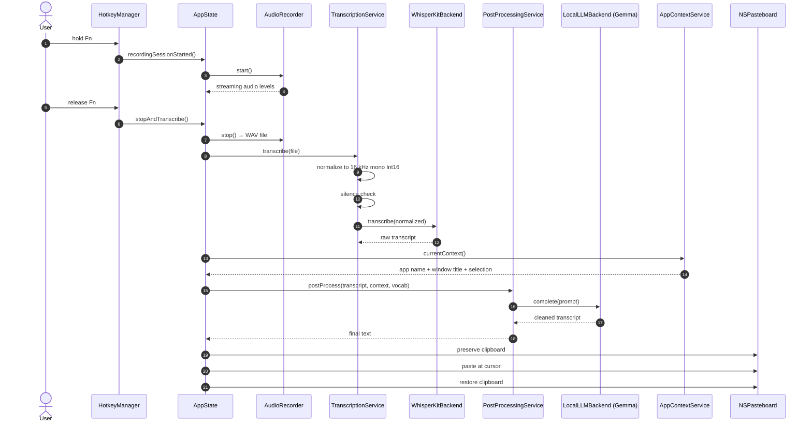

# Architecture

This document is a tour of the geMMaFloW codebase organized by subsystem, with a few diagrams showing how the pieces fit together. It's intended for someone who wants to modify the app or audit the privacy claims.

The app is a SwiftUI menu-bar app that runs as a single process. There is no background daemon, no helper tool, and no server component. The build produces one executable (`GemmaFlowCore`) packaged into `GemmaFlow.app`.

---

## High-level layout

```mermaid
flowchart TB
    subgraph UI[UI layer]
        MB[MenuBarView]
        SV[SetupView<br/>first-run wizard]
        ST[SettingsView]
        RO[RecordingOverlay]
        DB[PipelineDebugPanel]
    end

    subgraph Core[Core]
        AD[AppDelegate]
        AS[AppState<br/>@MainActor ObservableObject]
        HM[HotkeyManager]
        DSC[DictationShortcutSessionController]
    end

    subgraph Audio[Audio capture]
        AR[AudioRecorder]
        AN[AudioNormalization]
        AD2[AudioSilenceDetector]
        LN[LiveAudioLevelNormalizer]
        HF[HallucinationFilter]
    end

    subgraph Transcribe[Transcription]
        TS[TranscriptionService]
        TB[TranscriptionBackend]
        WKB[WhisperKitBackend]
        WKD[WhisperKitDownloadManager]
        WKM[WhisperKitModelChoice]
    end

    subgraph LLM[LLM cleanup]
        PPS[PostProcessingService]
        LB[LLMBackend]
        LBK[LLMBackendKind]
        LLB[LocalLLMBackend]
        LDM[LLMDownloadManager]
        LMC[LocalLLMModelChoice]
    end

    subgraph Context[Context & history]
        ACS[AppContextService]
        PHS[PipelineHistoryStore]
        PHI[PipelineHistoryItem]
    end

    AD --> AS
    AS --> HM
    HM --> DSC
    DSC --> AR
    AR --> AN --> AD2 --> TS
    TS --> WKB
    WKB --> WKD
    WKB --> WKM
    TS --> PPS
    PPS --> LLB
    LLB --> LDM
    LLB --> LMC
    ACS --> PPS
    PPS --> PHS
    AS --> MB & SV & ST & RO & DB
```

---

## Entry points and lifecycle

- [`App.swift`](../Sources/App.swift) — `@main` declares a `MenuBarExtra` scene. There is no main window; the app lives in the menu bar.
- [`AppDelegate.swift`](../Sources/AppDelegate.swift) — owns the shared `AppState`, decides whether to show the setup wizard or jump straight into hotkey-listening mode on launch, and handles the "complete setup" transition.
- [`AppState.swift`](../Sources/AppState.swift) — the heart of the app. One `@MainActor` `ObservableObject` holding every piece of state SwiftUI needs to observe: hotkey bindings, recording flags, current transcript, model choices, history. It also instantiates and owns the service objects (`TranscriptionService`, `PostProcessingService`, `AudioRecorder`, `HotkeyManager`).

This is a deliberately centralized design inherited from upstream FreeFlow. It's a "god object" by strict standards, but for a single-window menu-bar app it keeps the reactive glue in one place and makes the dictation pipeline trivially traceable.

---

## The dictation pipeline

The happy path, triggered by holding the dictation hotkey:



The pipeline has **no asynchronous queueing**: one dictation runs to completion before the next can start. This is intentional — it keeps the user's mental model simple ("hold, talk, wait, paste") and avoids the UX mess of overlapping pastes.

### Where the pipeline can short-circuit

- **Silence**: if the RMS level of the recording is below threshold, `TranscriptionService` skips WhisperKit and ends the session with no paste.
- **Empty transcript**: WhisperKit returns an empty string → no post-processing, no paste.
- **Hallucination filter**: [`HallucinationFilter.swift`](../Sources/HallucinationFilter.swift) catches known Whisper garbage ("Thank you.", "[Music]", "Bye.") on short inputs.
- **LLM retry**: if Gemma returns empty output, `PostProcessingService` retries once; on a second failure it falls back to the raw transcript rather than pasting nothing.

---

## Subsystems

### Audio capture

[`AudioRecorder.swift`](../Sources/AudioRecorder.swift) wraps `AVAudioEngine` with an input tap. [`LiveAudioLevelNormalizer.swift`](../Sources/LiveAudioLevelNormalizer.swift) feeds the recording overlay a smoothed level meter, and [`AudioNormalization.swift`](../Sources/AudioNormalization.swift) converts the captured float buffer to the 16 kHz mono Int16 WAV that WhisperKit wants. [`AudioSilenceDetector.swift`](../Sources/AudioSilenceDetector.swift) is a pure RMS threshold check invoked before transcription.

### Transcription

The transcription layer is abstracted behind [`TranscriptionBackend.swift`](../Sources/TranscriptionBackend.swift), a protocol, with a sentinel-URL routing scheme: `local://whisperkit/<model>` → `WhisperKitBackend`. The abstraction exists so cloud backends can be plugged back in for specific engagements; in the shipped build, `WhisperKitBackend` is the only backend compiled.

[`WhisperKitBackend.swift`](../Sources/WhisperKitBackend.swift) holds a pool of warm WhisperKit instances so the second dictation doesn't pay the model-load cost. [`WhisperKitDownloadManager.swift`](../Sources/WhisperKitDownloadManager.swift) surfaces download progress to the setup wizard; [`WhisperKitModelChoice.swift`](../Sources/WhisperKitModelChoice.swift) enumerates the curated model variants (Turbo / Large v3 / Small) with their HuggingFace repo IDs.

### LLM post-processing

[`PostProcessingService.swift`](../Sources/PostProcessingService.swift) holds the system prompt (dated and version-controlled so prompt changes are reviewable) and the logic for injecting app context, user vocabulary, and voice macros. It calls out to a backend via [`LLMBackend.swift`](../Sources/LLMBackend.swift), routed by [`LLMBackendKind.swift`](../Sources/LLMBackendKind.swift) through the same sentinel-URL convention: `local://mlx/<model-id>` → [`LocalLLMBackend.swift`](../Sources/LocalLLMBackend.swift).

`LocalLLMBackend` uses [`mlx-swift-examples`](https://github.com/ml-explore/mlx-swift-examples)' `MLXLMCommon` to load Gemma. Models are resolved via MLX's `LLMRegistry` — the app only stores the repo ID string, not a custom loader. [`LLMDownloadManager.swift`](../Sources/LLMDownloadManager.swift) exposes progress to the UI; [`LocalLLMModelChoice.swift`](../Sources/LocalLLMModelChoice.swift) is the user-facing preset list.

[`LLMAPITransport.swift`](../Sources/LLMAPITransport.swift) is residue from the cloud era. Nothing in the shipped build reaches it — the class it used to feed (`RemoteOpenAILLMBackend`) was deleted in commit `c2cb683`. It's queued for removal.

### Context awareness

[`AppContextService.swift`](../Sources/AppContextService.swift) reads the frontmost app's name, window title, and current selection via the macOS Accessibility API. Upstream FreeFlow also called a cloud LLM to summarize the window into a "context hint"; that path is gone. The constructor now sets `apiKey = ""` and the HTTP call is unreachable. What gets into the Gemma prompt is strictly the structured metadata — three strings — plus whatever the user highlighted.

### Hotkey handling

[`HotkeyManager.swift`](../Sources/HotkeyManager.swift) installs global `NSEvent` monitors for modifier and key events, with a `CFMachPort` event-tap fallback for environments where the monitor API is unreliable. [`ShortcutBinding.swift`](../Sources/ShortcutBinding.swift) is the Codable struct persisted to `UserDefaults`; [`ShortcutComponents.swift`](../Sources/ShortcutComponents.swift) parses key codes and modifier masks. [`DictationShortcutSessionController.swift`](../Sources/DictationShortcutSessionController.swift) turns low-level key events into the high-level "session started / session ended" events the rest of the app cares about. [`SetupTestHotkeyHarness.swift`](../Sources/SetupTestHotkeyHarness.swift) is the small test harness the setup wizard uses to verify the user's chosen shortcut actually fires.

### UI

- [`MenuBarView.swift`](../Sources/MenuBarView.swift) — the menu-bar icon. Different glyphs for idle / recording / transcribing.
- [`SetupView.swift`](../Sources/SetupView.swift) — the multi-step first-run wizard (welcome → language → permissions → shortcut → model download → test → done).
- [`SettingsView.swift`](../Sources/SettingsView.swift) — the preferences window (general / prompts / voice macros / run log).
- [`RecordingOverlay.swift`](../Sources/RecordingOverlay.swift) — the floating pill that shows live audio levels while you're dictating.
- [`PipelineDebugPanelView.swift`](../Sources/PipelineDebugPanelView.swift) / [`PipelineDebugContentView.swift`](../Sources/PipelineDebugContentView.swift) — a debug panel exposing the raw transcript, the cleaned transcript, and the exact prompt sent to Gemma for the last dictation.

### History

[`PipelineHistoryStore.swift`](../Sources/PipelineHistoryStore.swift) persists the last N dictations (`PipelineHistoryItem.swift`) to disk: raw transcript, cleaned transcript, prompt sent to Gemma, context snapshot, timestamp. This is the "run log" you see in Settings. It's a local JSON file — again, no network.

### Misc

- [`UpdateManager.swift`](../Sources/UpdateManager.swift) — stub for an in-app update check. Not wired to any server yet.
- [`ModelCacheCleaner.swift`](../Sources/ModelCacheCleaner.swift) — utility to wipe HuggingFace model caches when the user switches variants or wants to reclaim disk.
- [`Notification+VoiceToText.swift`](../Sources/Notification+VoiceToText.swift) — `Notification.Name` constants for the internal pub/sub between `AppState` and the services.

---

## Build system

- [`Package.swift`](../Package.swift) — SwiftPM manifest. Depends on `WhisperKit`, `mlx-swift-examples`, `swift-transformers`, `swift-huggingface`.
- [`Makefile`](../Makefile) — orchestrates the build:
  1. `swift build -c release` for the executable
  2. `xcodebuild` to compile MLX's Metal shaders into `default.metallib` (SwiftPM can't compile `.metal` files)
  3. Assembles `GemmaFlow.app`, copies `default.metallib` into `Resources/`
  4. Codesigns with a stable self-signed identity (`geMMaFloW Dev Signer`) so TCC permissions persist across rebuilds
- [`Info.plist`](../Info.plist) — declares `LSMinimumSystemVersion = 14.0`, `LSUIElement = true` (no Dock icon), microphone + accessibility usage strings.
- [`GemmaFlow.entitlements`](../GemmaFlow.entitlements) — audio input and unsigned-executable-memory (needed by MLX / WhisperKit JIT). **No network entitlements.**

---

## Testing

Tests live under [`Tests/GemmaFlowCoreTests/`](../Tests/GemmaFlowCoreTests/). Most are focused unit tests on pure functions (audio normalization, silence detection, shortcut parsing, hallucination filtering, backend-kind URL parsing). The pipeline itself is tested end-to-end with recorded audio fixtures in the same target. Run with `swift test`.
